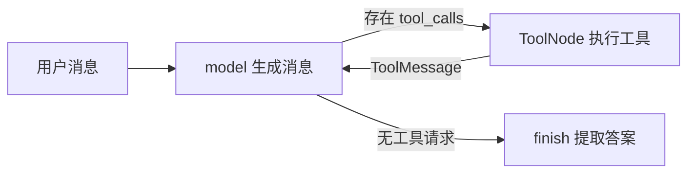

# [codex] 工具闭环与模型上下文

模型说“我要调用 add”，并不意味着 Python 函数已经执行。完整的 Agent 必须把调用请求交给工具，将结果关联到原请求，再让模型继续决策。先用固定模型逻辑验证这条链路，能把模型不稳定与图编排错误分开。

## 一个请求怎样走完工具闭环



这里有两个容易混淆的标识：消息自己的 `id` 用于消息更新；工具请求中的 `id` 与结果的 `tool_call_id` 配对，用于说明这次结果属于哪次调用。

## 完整示例：模型固定，工具真执行

```python
from langchain_core.messages import AIMessage, HumanMessage, ToolMessage
from langchain_core.tools import tool
from langgraph.graph import MessagesState, StateGraph, START, END
from langgraph.prebuilt import ToolNode, tools_condition

class State(MessagesState):
    answer: str

@tool
def add(a: int, b: int) -> int:
    """返回两个整数的和。"""
    return a + b

def model(state: State) -> dict:
    last = state["messages"][-1]
    if isinstance(last, ToolMessage):
        return {"messages": [AIMessage(content=f"答案: {last.content}")]}
    call = {"name": "add", "args": {"a": 3, "b": 4}, "id": "call-1", "type": "tool_call"}
    return {"messages": [AIMessage(content="", tool_calls=[call])]}

def finish(state: State) -> dict:
    return {"answer": state["messages"][-1].content}

builder = StateGraph(State)
builder.add_node("model", model)
builder.add_node("tools", ToolNode([add]))
builder.add_node("finish", finish)
builder.add_edge(START, "model")
builder.add_conditional_edges("model", tools_condition, {"tools": "tools", END: "finish"})
builder.add_edge("tools", "model")
builder.add_edge("finish", END)
graph = builder.compile()

if __name__ == "__main__":
    result = graph.invoke({"messages": [HumanMessage(content="计算 3 + 4")]},
                          {"recursion_limit": 10})
    messages = result["messages"]
    print(result["answer"])
    print([message.type for message in messages])
    assert result["answer"] == "答案: 7"
    assert messages[2].tool_call_id == messages[1].tool_calls[0]["id"]
    assert [message.type for message in messages] == ["human", "ai", "tool", "ai"]
```

可以观察到 `human → ai → tool → ai` 四条消息，以及答案 7。第一次 model 构造调用请求，ToolNode 执行 add，第二次 model 读取 ToolMessage 再作答。`tools_condition` 检查最后一条消息是否包含工具请求，映射决定后继。

修改用户提问文本不会自动改变计算参数，因为这个模型节点把 a、b 写死了。它验证的是工具执行与消息关联，没有验证模型理解能力；运行通过也不是 Agent 准确率评测。

## 保存的历史与本轮模型输入

实验 14 单独保存 messages 和 model_input。输入有六条历史消息，挑出系统消息与最新用户问题作为模型输入；生成新回复后，历史数量变为 7，本轮上下文数量仍是 2。

```python
def select_context(state: State) -> dict:
    return {"model_input": [state["messages"][0], state["messages"][-1]]}
```

这是针对普通问答的刻意简化。若历史包含工具调用，不能直接截最后两条：留下 ToolMessage 却丢掉对应 tool_calls，消息协议就不完整。生产策略应按完整调用组裁剪，保留必要的系统约束，并检查 Token 预算。

model_input 在这个实验中也是 State 字段；若增加 checkpointer，它也可能被保存。仅仅少发给模型，并不表示历史内容已从存储中删除。

## 从实验 11 换到真实模型

选学 22 保留工具定义和路由，把固定 model 节点换成绑定工具后的模型调用。仅在已有兼容服务时运行：

```bash
python -m pip install -r requirements-llm.txt
export LLM_MODEL="服务实际提供的模型名"
export LLM_BASE_URL="http://127.0.0.1:8080/v1"
python optional/22_real_tool_agent.py
```

fish 用 `set -gx LLM_MODEL "服务实际提供的模型名"` 等价设置环境变量。远程服务所需的 `LLM_API_KEY` 从环境传入，不写进代码。此例不会自动启动模型服务。

真实服务必须同时支持请求中的工具 schema 和返回的工具调用字段；不能仅凭聊天接口能返回文本就认为兼容。运行后查看消息轨迹与 tool_call_id，确认是否真的调用了工具。模型也可能直接回答，输出和循环次数不会像实验 11 那样固定。

本次没有连接真实模型运行选学 22。生产扩展还应在工具执行前落实参数校验、权限与副作用控制，而不是把模型请求当成执行授权。

## 动手验证

实验 11 将工具参数改成 10 和 20，预期得到 30。实验 14 再加一组普通问答，预期 history_count 为 9、context_count 仍为 2。最后对比 11 和 22 的差异，指出哪些部分负责模型能力，哪些部分负责图执行。

## 配套练习

运行命令均以 `examples/langgraph-mini-lab` 为当前目录；可点击文件查看完整源码。

| 实验 | 可运行文件 | 观察重点 |
|---|---|---|
| 11 | [工具调用闭环（模拟模型）](../../examples/langgraph-mini-lab/03_nodes/11_tool_agent.py) | AIMessage.tool_calls、@tool、ToolNode、ToolMessage、条件路由 |
| 14 | [保存历史不等于全部发送给模型](../../examples/langgraph-mini-lab/03_nodes/14_model_context.py) | 将保留的 messages 与本轮 model_input 分开 |
| 22 | [真实模型工具闭环](../../examples/langgraph-mini-lab/optional/22_real_tool_agent.py) | bind_tools 与真实模型兼容性 |

## 小结

- 模型生成调用意图，ToolNode 执行，ToolMessage 把结果带回循环。
- 消息 ID 和工具调用 ID 解决不同问题。
- 持久历史、模型输入、真实模型效果需要分别验证。

机制参考：[Workflows and agents](https://docs.langchain.com/oss/python/langgraph/workflows-agents)、[Memory](https://docs.langchain.com/oss/python/langgraph/add-memory)。

下一篇建议继续看：

- [[codex] 人工审批与跨进程恢复](../13-codex-interrupt-persistence/index.html)
