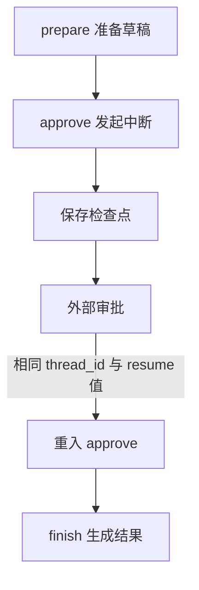

# [codex] 人工审批与跨进程恢复

发布草稿前要等人工确认，审批可能隔几个小时才回来，服务期间还可能重启。把一个函数阻塞在那里等输入，无法解决这种任务恢复。我们需要保存执行位置，再用同一个任务标识继续。

## 中断需要哪些条件

`interrupt()` 提交待审批数据，checkpointer 保存图状态，`thread_id` 找回对应任务。恢复时传 `Command(resume=...)`，该值会成为中断调用的返回结果。



这是运行生命周期图；外部审批不是图里额外注册的业务节点。

## 先验证内存中的暂停与继续

```python
from typing import TypedDict
from langgraph.checkpoint.memory import InMemorySaver
from langgraph.graph import StateGraph, START, END
from langgraph.types import Command, interrupt

class State(TypedDict):
    request: str
    approved: bool
    result: str

def prepare(state: State) -> dict:
    return {"request": state["request"].strip()}

def approve(state: State) -> dict:
    print("进入审批")
    approved = interrupt({"request": state["request"]})
    if not isinstance(approved, bool):
        raise ValueError("审批结果必须是 True 或 False")
    return {"approved": approved}

def finish(state: State) -> dict:
    return {"result": "已批准" if state["approved"] else "已拒绝"}

builder = StateGraph(State)
builder.add_node("prepare", prepare)
builder.add_node("approve", approve)
builder.add_node("finish", finish)
builder.add_edge(START, "prepare")
builder.add_edge("prepare", "approve")
builder.add_edge("approve", "finish")
builder.add_edge("finish", END)
graph = builder.compile(checkpointer=InMemorySaver())

if __name__ == "__main__":
    config = {"configurable": {"thread_id": "approval-1"}}
    paused = graph.invoke({"request": " 发布草稿 "}, config)
    print("暂停:", paused["__interrupt__"][0].value)
    assert graph.get_state(config).next == ("approve",)
    result = graph.invoke(Command(resume=True), config)
    print(result["result"])
    assert result["approved"] is True
    assert graph.get_state(config).next == ()
```

你会看到“进入审批”打印两次。恢复从 approve 节点开头重新执行，而不是从 Python 调用栈里原地接着往下走。把扣款、发送通知等副作用写在 interrupt 前面，重入时就可能重复发生。

示例检查审批结果必须是 bool；字符串 `"False"` 不是合法的拒绝值。不要用一个宽泛的 try/except 把 interrupt 的控制信号吞掉，也不要随意改变同一节点里多个 interrupt 的调用顺序。

## 把内存保存换成 SQLite

实验 20 将 saver 换成 `SqliteSaver`，还增加 execute 节点。下列代码是该文件中的关键配置片段，完整文件可从练习索引打开：

```python
config = {"configurable": {"thread_id": "sqlite-demo"}}
with SqliteSaver.from_conn_string(str(data_dir / "lesson20.sqlite")) as saver:
    graph = builder.compile(checkpointer=saver)
    snapshot = graph.get_state(config)
```

所有调用都在连接的 with 生命周期内进行。安装可选依赖后，在实验目录分别运行四条命令；每条命令都是一个新的 Python 进程：

```bash
python -m pip install -r requirements-sqlite.txt
python 04_nodes/20_sqlite_resume.py start
python 04_nodes/20_sqlite_resume.py status
python 04_nodes/20_sqlite_resume.py resume
python 04_nodes/20_sqlite_resume.py status
```

预期先看到 `待执行: ('approve',)`，恢复后看到 `模拟发布完成。` 和 `待执行: ()`。这里的发布只是字符串，不会发布网站或发送任何消息。

手工数据库位于当前工作目录的 `.runtime/lesson20.sqlite`。同一数据库、同一 thread_id、兼容的图定义缺一不可；换目录导致创建空数据库时，不能把“找不到暂停任务”理解为恢复成功。

## 三种调用不要混淆

| 调用 | 本系列中的含义 |
|---|---|
| `invoke({...}, config)` | 提供本轮新输入，已有 thread 状态可能参与合并 |
| `invoke(Command(resume=True), config)` | 给当前人工中断传入批准结果 |
| `get_state(config)` | 查看已保存状态和 next，不推进业务节点 |

异常失败后的继续执行是另一类场景，不能把所有恢复都写成 `Command(resume=True)`。发布带长生命周期任务的图时，还要考虑节点重命名、删除和 State 结构变化对旧检查点的兼容影响。

`next == ()` 表示当前快照没有待执行节点；若业务返回的是“已拒绝”或失败结果，也可能没有待执行节点，因此仍需检查业务结果。

## 动手验证

将实验 12 的 resume 改为 False，确认得到已拒绝。实验 20 在 start 后先退出终端，再在同一实验目录运行 status 和 resume；重复 start 应拒绝覆盖暂停任务。不要通过删除数据库绕过未审批任务。

## 配套练习

运行命令均以 `examples/langgraph-mini-lab` 为当前目录；可点击文件查看完整源码。

| 实验 | 可运行文件 | 观察重点 |
|---|---|---|
| 12 | [人工审批与恢复](../../examples/langgraph-mini-lab/03_nodes/12_interrupt_resume.py) | interrupt、Command(resume=...)、checkpointer、同一个 thread_id |
| 20 | [SQLite 跨进程恢复](../../examples/langgraph-mini-lab/04_nodes/20_sqlite_resume.py) | SqliteSaver 写磁盘；先 start 退出程序，再 resume 恢复同一会话 |

## 小结

- 人工审批恢复依赖保存位置和任务标识，不能靠进程内变量。
- 中断节点会重入，副作用必须另有保护。
- 执行结束和业务通过是两种验收证据。

机制参考：[Interrupts](https://docs.langchain.com/oss/python/langgraph/interrupts)、[Persistence](https://docs.langchain.com/oss/python/langgraph/persistence)。

下一篇建议继续看：

- [[codex] 重试策略与业务幂等](../14-codex-retry-idempotency/index.html)
